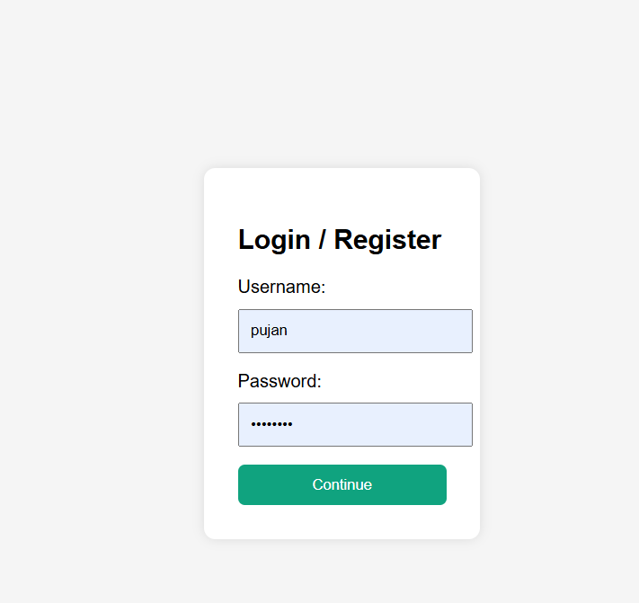
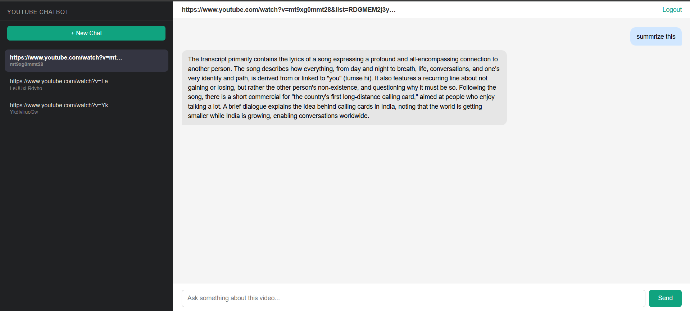

# YouTube Chatbot

A RAG-powered chatbot that lets you have a conversation with any YouTube video. Paste a video URL, ask questions, and get answers grounded in the video's transcript — not hallucinated.

Built with Django, LangChain, FAISS, and Google Gemini.

---

## How It Works

```
YouTube URL → Transcript → Text Chunks → FAISS Embeddings → Retrieval → Gemini → Answer
```

1. The video transcript is fetched via `youtube-transcript-api`
2. Transcript is split into overlapping chunks
3. Chunks are embedded and stored in a FAISS vector store
4. On each question, relevant chunks are retrieved and passed to Gemini as context
5. Gemini answers strictly from the retrieved context

---

## Features

- **Session-based chat** — each video gets its own conversation thread, similar to ChatGPT
- **Multi-language support** — falls back to auto-translated English if no English transcript exists
- **Embedding cache** — retriever is cached in memory per video ID, so repeated questions on the same video don't rebuild embeddings
- **Auth** — login and auto-register with a single form; sessions are user-specific
- **Clean UI** — sidebar lists all video sessions, click to switch between them

---

## Screenshots

### Login



### Chat



## Tech Stack

| Layer         | Technology              |
| ------------- | ----------------------- |
| Backend       | Django 6                |
| RAG Framework | LangChain               |
| Vector Store  | FAISS                   |
| LLM           | Google Gemini 2.5 Flash |
| Transcript    | youtube-transcript-api  |
| Auth          | Django built-in auth    |
| Database      | SQLite (dev)            |

---

## Project Structure

```
chatbot/
├── backend/                  # Django app
│   ├── models.py             # VideoSession, ChatMessage
│   ├── views.py              # Auth, chat, session logic
│   ├── forms.py
│   ├── urls.py
│   └── templates/backend/
│       ├── home.html
│       └── login.html
├── rag_components/           # RAG pipeline
│   ├── transcript.py         # Fetch & translate transcripts
│   ├── splitting.py          # Chunk the transcript
│   ├── embeddingsandvectorstore.py  # FAISS vector store
│   ├── augmentation.py       # Prompt template
│   └── Chains.py             # LangChain chain + retriever cache
├── chatbot/                  # Django project settings
│   ├── settings.py
│   └── urls.py
└── manage.py
```

---

## Getting Started

### Prerequisites

- Python 3.10+
- A [Google AI Studio](https://aistudio.google.com/) API key for Gemini

### Installation

```bash
git clone https://github.com/PujanPandey07/youtube-chatbot.git
cd youtube-chatbot/chatbot

python -m venv env
source env/bin/activate        # Windows: env\Scripts\activate

pip install -r requirements.txt
```

### Environment Variables

Create a `.env` file in the `chatbot/` directory:

```env
GOOGLE_API_KEY=your_google_api_key_here
SECRET_KEY=your_django_secret_key_here
```

### Run

```bash
python manage.py migrate
python manage.py runserver
```

Visit `http://127.0.0.1:8000`

---

## Usage

1. Register or log in with any username and password
2. Paste a YouTube URL and ask your first question
3. The video session appears in the sidebar — click it anytime to continue that conversation
4. Start a new chat with a different video using the **+ New Chat** button

---

## Limitations

- Transcripts must be available on the video (auto-generated captions count)
- Embedding cache is in-memory and resets on server restart
- SQLite is used for development — switch to PostgreSQL for production deployment

---

## Author

**Pujan Pandey**
[GitHub](https://github.com/PujanPandey07)

#
